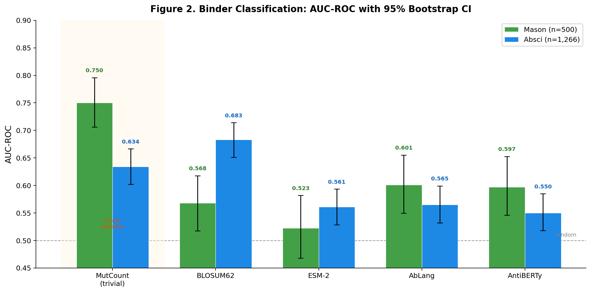
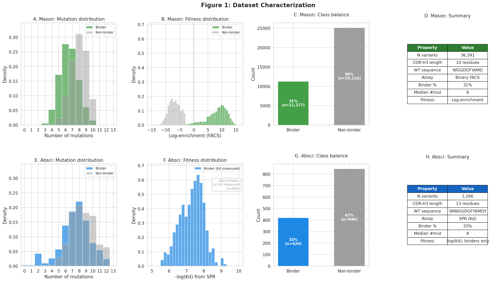
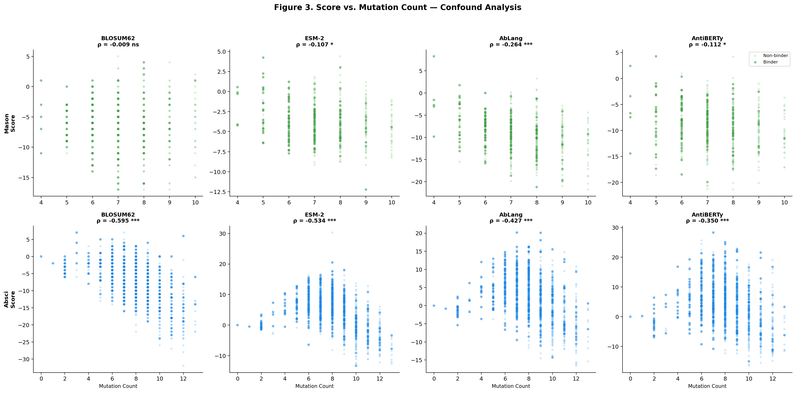
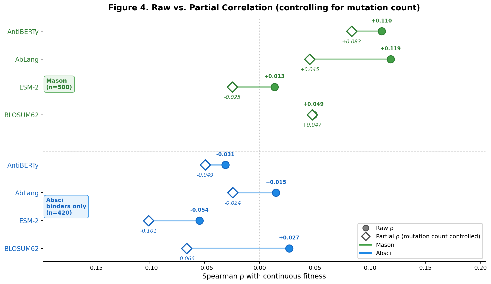
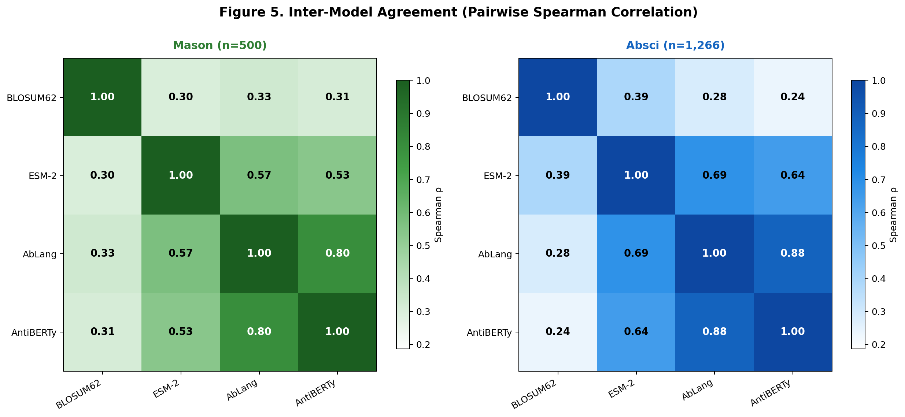

# Antibody PLM Benchmark

**Can protein language models predict antibody fitness better than a substitution matrix?**

A systematic benchmark of antibody-specific PLMs (AbLang, AntiBERTy) vs. a general-purpose PLM (ESM-2) vs. BLOSUM62 for variant fitness prediction on combinatorial CDR-H3 libraries.

<p align="center">
  
</p>

## Key Findings

**BLOSUM62 is the only model that beats counting mutations** — and only on one of two datasets. After controlling for the mutation-count confound, no protein language model significantly predicts continuous antibody fitness.

Specifically:

1. **Mutation count is a devastating trivial baseline.** On Mason (binary FACS data), simply counting how many mutations a variant has from the parental sequence achieves AUC = 0.750 — higher than any model. On Absci (quantitative SPR), mutation count still reaches AUC = 0.634.

2. **No PLM provides unique information beyond BLOSUM62.** Ensembling any PLM with BLOSUM62 always degrades performance. The antibody-specific models (AbLang, AntiBERTy) are nearly redundant with each other (Spearman ρ = 0.88), both trained on the Observed Antibody Space.

3. **ESM-2 anti-predicts on quantitative affinity data.** After partialling out mutation count, ESM-2 shows a significant *negative* correlation with fitness (partial ρ = −0.101) on Absci — it systematically assigns higher scores to weaker binders. This likely reflects its general evolutionary prior penalizing the hypervariability that CDR-H3 requires.

4. **Assay resolution determines whether sequence-aware models add value.** Binary FACS sorting → just count mutations. Quantitative SPR → BLOSUM62 substitution identity adds value. PLMs add nothing in either case.

## Datasets

| Property | Mason et al. 2021 | Absci HER2 SPR |
|---|---|---|
| Antibody | Trastuzumab scFv | Trastuzumab IgG |
| CDR-H3 length | 10 residues | 13 residues |
| Library type | Combinatorial | Combinatorial |
| Variants scored | 500 (subsample) | 1,266 (full, same-length) |
| Fitness readout | Binary FACS (binder/non-binder) | Quantitative SPR (Kd in nM) |
| Mutations/variant | Median 6–7 | Median 7–8 |
| Source | [Mason et al., Nature BME 2021](https://github.com/dahjan/DMS_opt) | [Engelhart et al., 2022](https://doi.org/10.1101/2022.01.31.478500) |

Both datasets are **combinatorial CDR-H3 libraries** — most variants carry 4–9 simultaneous mutations from the parental sequence. This distinguishes them from typical deep mutational scanning (single-point) studies in benchmarks like ProteinGym.

## Models

| Model | Type | Training Data | Scoring Method |
|---|---|---|---|
| **BLOSUM62** | Substitution matrix | Curated protein alignments | Sum of BLOSUM62(wt_i, mut_i) at mutated positions |
| **ESM-2 (650M)** | General protein PLM | UniRef50 (>60M sequences) | Masked marginal: Σ [log P(mut_i) − log P(wt_i)] |
| **AbLang** | Antibody-specific PLM | OAS (>500M antibody sequences) | Masked marginal (heavy chain) |
| **AntiBERTy** | Antibody-specific PLM | OAS (>500M antibody sequences) | Masked marginal (heavy chain) |

## Results

### Classification (AUC-ROC)

| Model | Mason (n=500) | Absci (n=1,266) |
|---|---|---|
| MutCount (trivial) | **0.750** | 0.634 |
| BLOSUM62 | 0.568 | **0.683** |
| ESM-2 | 0.523 | 0.561 |
| AbLang | 0.601 | 0.565 |
| AntiBERTy | 0.597 | 0.550 |

### Continuous Fitness Correlation (Spearman ρ)

| Model | Mason raw ρ | Mason partial ρ | Absci raw ρ | Absci partial ρ |
|---|---|---|---|---|
| BLOSUM62 | +0.049 | +0.047 | +0.027 | −0.066 |
| ESM-2 | +0.013 | −0.025 | −0.054 | **−0.101** |
| AbLang | +0.119 | +0.045 | +0.015 | −0.024 |
| AntiBERTy | +0.110 | +0.083 | −0.031 | −0.049 |

*Partial ρ controls for mutation count. Absci continuous fitness uses binders only (n=420) since non-binders lack measured Kd.*

## Figures

| | |
|---|---|
|  |  |
| **Fig 1.** Dataset characterization | **Fig 2.** AUC-ROC comparison |
|  |  |
| **Fig 3.** Score–mutation count confound | **Fig 4.** Raw vs. partial correlation |

<p align="center">
  
</p>
<p align="center"><b>Fig 5.</b> Inter-model agreement heatmaps</p>

Detailed figure interpretations are in [`figures/figure_descriptions.txt`](figures/figure_descriptions.txt).

## Quickstart

```bash
# Clone and set up environment
git clone https://github.com/YOUR_USERNAME/antibody-plm-benchmark.git
cd antibody-plm-benchmark
conda env create -f environment.yml
conda activate ab-plm-bench

# Download datasets
python data/download_mason.py
python data/download_absci.py

# Run BLOSUM62 baseline (no GPU needed)
python run_benchmark.py --dataset mason --models blosum
python run_benchmark.py --dataset absci --models blosum

# Run all models (requires GPU for PLMs)
python run_benchmark.py --dataset mason --models blosum esm2 ablang antiberty
python run_benchmark.py --dataset absci --models blosum esm2 ablang antiberty
```

## Project Structure

```
antibody-plm-benchmark/
├── README.md
├── environment.yml
├── run_benchmark.py             # Main CLI — score + evaluate
├── data/
│   ├── download_mason.py
│   ├── download_absci.py
│   ├── raw/                     # Original downloaded CSVs
│   └── processed/               # Cleaned datasets
├── models/
│   ├── blosum.py                # BLOSUM62 scorer
│   ├── esm2.py                  # ESM-2 masked marginal scorer
│   ├── ablang_scorer.py         # AbLang scorer
│   └── antiberty_scorer.py      # AntiBERTy scorer
├── evaluation/
│   ├── metrics.py               # AUC, Spearman, bootstrap CI
│   └── stratify.py              # CDR/framework stratification
├── results/                     # Scored variant CSVs
├── figures/                     # Publication-quality figures
└── notebooks/
    └── lab_notebook.md          # Full analysis narrative
```

## Context: Why This Matters

Standard PLM benchmarks like [ProteinGym](https://proteingym.org/) (Notin et al., 2023) overwhelmingly evaluate on single-point mutations, where additive models perform well by construction. Real antibody engineering campaigns produce **combinatorial libraries** with many simultaneous mutations, especially in CDR-H3 — the primary determinant of antigen specificity.

Our results suggest that on combinatorial CDR-H3 data, current PLMs (both general and antibody-specific) fail to capture the epistatic interactions that determine binding. The field's reported PLM accuracies may not transfer to the multi-mutation regimes that matter in practice.

Related work:

- Qiu & Marks (2025) — Scaling PLMs improves single-mutant but not multi-mutant fitness prediction
- Notin et al. (2023) — ProteinGym benchmark (predominantly single-point DMS)
- AbMAP (PNAS 2025) — Antibody embedding benchmarks, similar limitations in combinatorial regimes
- Kenlay et al. (PLoS Comp Bio 2025) — Nucleotide-level context models for antibody engineering

## License

MIT
