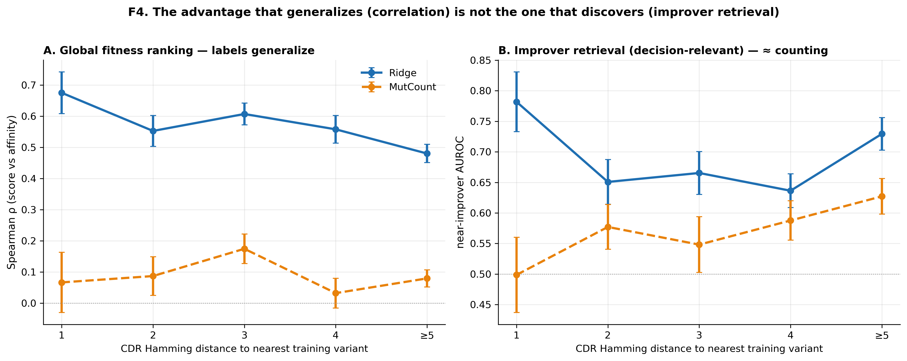

# Antibody PLM Benchmark — Leakage- and Budget-Aware Improver Retrieval

*A single-target methods benchmark of **evaluation practice and model selection**
for antibody affinity maturation — not a new predictor. Intended as a workshop
methods contribution.*

**Headline.** On a realistic lead-optimization task — a handful of measured
CDR variants, no per-variant structure, and one goal: enrich the rare variants
that *beat the parent* (improvers) — **no method evaluated here robustly beats a
parameter-free mutation counter at the discovery decision that matters**, and
*what you conclude flips with the metric, the label budget, and the task.*

<p align="center">
  
</p>

---

## 1. Motivation — why this matters

Antibody affinity maturation is a resource-bound search: from a large
combinatorial CDR library, a team can only synthesize and assay a small number of
variants per round, so the decision is *which* variants to make. Protein language
models (PLMs), inverse-folding models, and low-N supervised regressors are
increasingly used to rank that library — often zero-shot, often trusted on the
strength of a global correlation reported on a random split.

The decision that actually consumes wet-lab budget, though, is not "predict every
Kd" but "put the rare improvers at the top of a short list." A model can look good
on global correlation and still be useless — or worse than free — at that
top-of-list decision. Getting this wrong wastes synthesis and assay rounds. This
repository asks whether the tools now being adopted are actually better than
trivial baselines at the improver-retrieval decision, under an evaluation designed
to expose the failure modes a random-split correlation hides.

## 2. Background — what has been done, and the gap

Combinatorial antibody libraries (e.g. Mason 2021, Absci HER2) and general protein
fitness benchmarks are typically scored by **global correlation on random splits**,
and recent antibody benchmarks (e.g. AbBiBench) report **inverse-folding / PLM
advantages** under that setup. Two properties of combinatorial CDR data make those
numbers optimistic:

- **Mutation-count structure.** Fitness correlates strongly with edit distance
  from the parent, so any score that tracks mutation count inherits an apparent
  signal — a confound a raw correlation does not separate.
- **Near-duplicate leakage.** Variants share mutations, so a random split places
  near-duplicates of training points in the test set; the model memorizes rather
  than generalizes.

Distance-aware splitting is established in general protein fitness work (FLIP;
Hsu et al.). **The gap:** it has not been applied, together with a
discovery-relevant and label-budget-matched protocol, to *antibody improver
retrieval* — the setting where it overturns the supervised advantage. That is the
gap this benchmark fills.

## 3. Research questions

- **Q1 — Zero-shot.** Do zero-shot PLMs, BLOSUM62, or inverse folding beat a
  mutation counter at *enriching improvers*?
- **Q2 — Structure.** Does fixed-backbone inverse folding add improver signal
  *beyond* mutation count (partial correlation)?
- **Q3 — Supervised.** Once near-duplicate leakage is removed, does low-N
  supervision convert a global-correlation edge into a *discovery* edge?
- **Q4 — Robustness.** Do the conclusions hold across metric (correlation vs
  precision@K), label budget (N), and task (improver vs binder retrieval)?

## 4. Models and evaluation protocol

**Models** (brief rationale — why each is in the panel):

| Model | Type | Why included |
|---|---|---|
| **Mutation count** | trivial parent-distance | the baseline every method must beat |
| **BLOSUM62** | substitution-scored distance | distance baseline that adds biochemistry |
| **ESM-2 (650M)** | general PLM, masked-marginal | the most-used zero-shot ranker; a naturalness prior |
| **AbLang, AntiBERTy** | antibody-specific PLMs | germline / repertoire prior (do antibody LMs help?) |
| **AntiFold** | inverse folding on the crystal | structure prior (fixed backbone, PDB 1N8Z) |
| **Ridge** (one-hot / compact) | low-N supervised | does spending a few labels beat counting? |

**Evaluation protocol** (the reusable contribution — a pre-campaign checklist for
vetting any affinity-ranking method, internal or vendor):

1. Report a **mutation-count baseline** (and BLOSUM62).
2. Use **distance- / cluster-aware splits**; report the minimum train–test distance
   and quantify near-duplicate leakage.
3. Report a **stringent, budget-matched precision@K / recall@K**, not only a global
   correlation.
4. **Separate the tiers** — binder vs beat-parent (improver) retrieval; report the
   rare strict tier with its *n* and CIs, and a robust relaxed tier.
5. **Control structure / likelihood scores for mutation count** (partial ρ).
6. **Correct for multiple comparisons**; label borderline effects nominal.

## 5. Findings

1. **Zero-shot (Q1): two edit-distance-like priors, and only one enriches
   improvers.** Parent-distance baselines — mutation count (near-tier MW
   p = 3.2×10⁻⁷) and BLOSUM62 (p = 1.9×10⁻³) — significantly enrich improvers; the
   antibody PLMs do not. That behavioural divergence shows the PLMs encode a
   *different* sequence-naturalness prior (consistent with documented germline
   bias), not the parent-distance prior. Its usefulness **flips with the task**
   (Q4): on a second library under binder retrieval (Mason) the same PLMs *enrich*
   binders (p ≈ 10⁻⁴), because binders there are low-mutation. See `figures/F2`.
2. **Structure (Q2): fixed-backbone inverse folding reduces to counting.** AntiFold
   on the trastuzumab–HER2 crystal (scored over all heavy CDRs) out-enriches BLOSUM,
   yet its affinity correlation vanishes once mutation count is controlled
   (raw ρ = +0.135 → partial ρ = +0.003 / −0.074, n.s.; ρ = −0.71 with mutation
   count). See `figures/F3`. We raise, as a testable question, whether reported
   inverse-folding advantages are partly a mutation-count artifact.
3. **Supervised (Q3): a global-ranking edge that does not become a discovery edge.**
   With near-duplicate leakage removed via distance-aware splits, a plain ridge
   keeps a distance-robust *correlation* advantage (ρ 0.68→0.48 vs a flat counter)
   but ≈ counting under a stringent, budget-matched precision@K; the rare-tier
   recall estimate is large on the balanced split but uncertifiable on n = 5.
   Leakage inflates the apparent advantage only modestly (≈1.4×). See `figures/F1`
   (leakage) and `figures/F4` (correlation vs discovery).

## 6. What we corrected (self-audit)

The result is only as trustworthy as the checks that survived. Several early
numbers moved under scrutiny; we report the corrected values and keep the process
visible (full log in `validation_checklist.md`):

- **Full-CDR basis (foundational).** The first analysis scored CDR-H3 only; the
  Absci variants also vary in HCDR1/HCDR2. Everything — features, distance/leakage,
  and structure scoring — was re-run on the complete 29-position full-CDR basis.
  **The conclusions held**, and the correlation-vs-discovery split got cleaner.
- **Leakage was overstated.** CDR-H3-only distance exaggerated near-duplication:
  within-Hamming-≤2 overlap **39% → 27%**, exact duplicates **14 → 0**, correlation
  inflation **≈1.4× (not ~2×)**. We therefore do *not* headline leakage magnitude.
- **A likelihood signal demoted.** ESM-2's partial correlation was nominally
  anti-fitness on the CDR-H3 basis (ρ = −0.11, p = 0.02) but did **not** survive
  full-CDR re-scoring (n.s.). We dropped it as evidence and lead the mechanism with
  a model-free divergence between the two priors instead.
- **Tie-consistent statistics.** The strict-tier enrichment p-value rested on a
  score tie; correcting it consistently (midrank Mann–Whitney) moved it
  **0.028 → 0.075** (a trend, not significance). Tie correction is now applied to
  *every* rank statistic.
- **Mason is task-dependence, not a naive replication.** We expected the zero-shot
  anti-ranking to replicate on Mason; instead the PLMs *enrich* binders there. The
  honest reading is that the sign of the PLM effect **flips with the task**, which
  became a load-bearing part of the thesis rather than a failed replication.
- **Multiple comparisons.** Across the family of enrichment tests, only the strong
  effects survive Bonferroni; borderline effects are labelled nominal.

## 7. Practical implications for antibody discovery

- **A free baseline that saves wet-lab rounds.** Before trusting any zero-shot
  model or vendor tool to rank affinity-maturation variants, check it beats "fewer
  mutations from the parent." Most methods here do not.
- **A go/no-go correction.** In-house supervised models validated with *random*
  splits on combinatorial libraries return optimistic upper bounds; use
  distance-aware splits + budget-matched precision@K before deploying.
- **A model-routing heuristic.** Because antibody PLMs encode a germline /
  naturalness prior, they *help* for germline-aligned objectives (humanness,
  developability, immunogenicity) but *hurt* for affinity improver-ranking — use
  them for the former, not the latter.
- **A QA standard** — the §4 protocol, as a pre-campaign checklist for vetting any
  affinity-prediction method.

## Data — not redistributed

Source datasets (Absci HER2 SPR Kd, Mason 2021 FACS, KyDab) are **not** included.
The tables in `results/` ship our **computed columns only** (sequences, mutation
counts, model scores); the source authors' **measured values** (Absci/KyDab Kd,
Mason binder labels + enrichment) are stripped. Download the data from the original
sources (`data/raw/README.md`) and restore the measured values before running the
analysis:

```bash
python scripts/merge_fitness.py absci --raw /path/to/absci_her2_spr.csv
python scripts/merge_fitness.py kydab --raw /path/to/kydab.csv
python scripts/merge_fitness.py mason --raw /path/to/mason_cdrh3.csv
```

Model weights (ESM-2, AbLang, AntiBERTy, AntiFold), PLM embeddings, and the 1N8Z
crystal are downloaded / regenerated by the code, not committed.

## Quickstart

```bash
conda env create -f environment.yml           # analysis env (numpy/scipy/sklearn)
conda env create -f environment_antifold.yml   # optional: AntiFold (isolated deps)

# 1. get data + restore measured values (see data/raw/README.md), then:
python scripts/merge_fitness.py absci --raw <your absci table>

# 2. reproduce the improver-retrieval analysis and figures
python experiments/e1_antirank.py             # Q1: zero-shot enrichment / anti-ranking
python experiments/e2f_distance_split.py      # Q3: leakage-free supervised retrieval
python experiments/e4b_fullcdr_eval.py        # Q2: structure partial-ρ (full-CDR)
python figures/make_figures.py                # F1–F4
```

## Repository layout

```
models/         scorers: BLOSUM62, ESM-2, AbLang, AntiBERTy (masked-marginal)
evaluation/     metrics — improver_metrics.py, lowN_protocol.py, metrics.py, stratify.py
experiments/    the analysis: e1* zero-shot, e2* supervised + leakage, e4* structure
structures/     AntiFold fixed-backbone scoring on 1N8Z (antifold env)
data/           download_*.py + data/raw/README.md (access instructions)
scripts/        merge_fitness.py (restore source measured values)
results/        computed scores + derived-metric CSVs (no source measured values)
figures/        F1–F4 + make_figures.py
```

**`CODEMAP.md`** documents every script — its role, its output CSV, and whether it
is on the default path, a robustness check, or a regenerate-from-scratch step — so
nothing in the tree is unexplained.

## Reproducibility

Every recorded number comes from a committed script; metrics recompute from the
scored CSVs (no model re-run needed for a new metric). Structure tools are isolated
in a separate conda env (`environment_antifold.yml`) because their pinned
dependencies conflict with the analysis stack. The robustness log
(`validation_checklist.md`) names the artifact behind each claim.

## Limitations

Single target (trastuzumab / HER2); the strict improver tier is n = 5 (we lean on a
robust near tier and multi-seed CIs); the structure arm is fixed-backbone only
(per-variant structure is future work); the zero-shot PLM scores model CDR-H3
variation only (HCDR1/2 variation — 20% of variants but **0% of improvers** — is
unmodeled; conclusions re-verified on the exactly-scored subset). See
`validation_checklist.md`.

## License

Code and computed outputs: MIT (`LICENSE`). Third-party datasets and model weights
are not covered and not redistributed.
